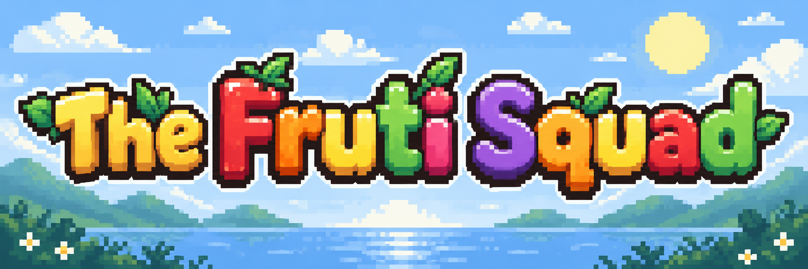
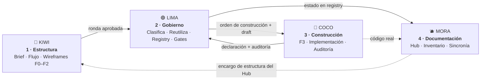
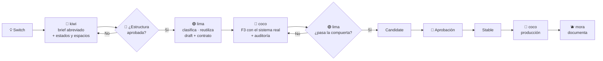

<div align="center">



# 🍓 Fruti Squad

### 🥝 kiwi ·  coco ·  lima ·  mora

**Un pequeño equipo para diseñar, gobernar y documentar sistemas de diseño sin convertir el repositorio en una selva de reglas duplicadas.**

<br>

[](LICENSE)


```bash
npx github:kevinedgm/fruti-squad install --target kiro   # o claude / codex
```

<br>

**Una configuración. Cuatro especialistas. Contexto compartido sin redescubrir el proyecto.**

</div>

---

## ✨ ¿Qué es Fruti Squad?

**Fruti Squad** es un conjunto portable de agentes y skills para diseñar, gobernar y documentar interfaces.

Cada miembro tiene una responsabilidad clara:

| Paso | Miembro  | Actividad       | Se encarga de |
| ---- | -------- | --------------- | ------------- |
| 1 | 🥝 **kiwi** | **Estructura**   | Brief funcional, user flow y wireframes F0–F2 en grises por espacio |
| 2 | 🟢 **lima** | **Gobierno**     | Clasificar, reutilizar, registrar, fijar el contrato y decidir el estado de cada pieza |
| 3 | 🥥 **coco** | **Construcción** | Alta fidelidad con el sistema real, implementación y auditoría |
| 4 | 🫐 **mora** | **Documentación**| Publicar en el Hub lo implementado y verificado, y mantenerlo sincronizado |

Los cuatro usan un único perfil:

```text
profiles/<proyecto>.md
```

El proyecto se describe **una sola vez**.

Después:

```text
🥝 kiwi
🟢 lima
🥥 coco   ──────► leen la misma verdad
🫐 mora
```

---

## 🍓 Cómo funciona el equipo



**Cómo se lee:**

1. **kiwi** resuelve qué hace la pantalla y cómo se ordena en cada espacio. Tú apruebas la estructura y queda congelada.
2. **lima** decide qué es del sistema y qué es local, reutiliza lo que ya existe, registra lo nuevo como `draft` y fija el contrato. Le da a coco una orden de construcción.
3. **coco** aplica el sistema real e implementa. Su declaración de cumplimiento (con la auditoría) vuelve a **lima**, que pasa las compuertas `candidate`/`stable` y actualiza el registry.
4. **mora** documenta lo que dicen el registry y el código real. Nada más.

**Retornos:** cualquiera devuelve un defecto a quien lo originó: estructura → kiwi, estado o contrato → lima, diseño o código → coco, documentación → mora. Cuando lo que cambia es la **estructura del propio Hub**, mora redacta un encargo documental y kiwi lo wireframea.

> ### Regla de oro
>
> **🥝 kiwi estructura → 🟢 lima gobierna → 🥥 coco construye → 🫐 mora documenta**

Una actividad por fruta.

No hay dos auditores.

No hay dos lifecycle managers.

No hay una documentación que decide por su cuenta cómo debería funcionar el producto.

Cada fruta conoce su parcela. Milagroso.


---

# 🚀 Instalación rápida

Fruti Squad se instala directamente desde GitHub, sin publicar en npm.

**Recomendado — `setup` (un comando, y él te pregunta lo demás):**

```bash
npx github:kevinedgm/fruti-squad setup --target kiro   # o claude / codex
```

Esto instala el Squad y luego **te hace unas pocas preguntas en la terminal** (un asistente) para armar tu perfil. No necesitas crear ningún archivo ni saber YAML. El asistente tiene dos caminos:

- **¿Ya tienes design system?** → te pide nombre, color de acción, color de peligro, superficie, tinta y fuente. Con eso arma el perfil completo.
- **¿Aún no / estás empezando?** → responde "no": crea el perfil con `design_system: NEW` y **lima te ayuda a definir un sistema mínimo después**, cuando diseñes lo primero. Cero datos inventados.

En ambos casos, al terminar no queda nada que llenar a mano: `coco.data_contract` arranca en `none-yet` y coco lo va escribiendo solo mientras diseñas.

> **El perfil es vivo — lo actualizas hablando.** ¿Instalaste sin design system (`NEW`)? Cuando lo tengas, solo dile a lima en lenguaje natural: *"mi design system es X, acción #…, fuente Inter"* y actualiza el perfil (no reinstalas nada). Igual para cambios luego: *"lima, cambia el color de peligro a #…"*, *"coco, agrega la entidad Pedido…"*, *"mora, el shell activo del Hub es assets/hub-shell.css"*. Cada quien mantiene su parte del perfil.

**Solo instalar** (sin el asistente), si quieres control total del paso a paso:

```bash
npx github:kevinedgm/fruti-squad install --target kiro   # o claude / codex
npx github:kevinedgm/fruti-squad install                 # autodetecta el entorno
```

Autodetección del entorno cuando omites `--target`:

```text
.kiro / .agents  ─────► Kiro
.claude          ─────► Claude Code
.codex / AGENTS.md ───► Codex
sin coincidencia ─────► Kiro
```

Sin npm / desde el clon:

```bash
git clone https://github.com/kevinedgm/fruti-squad.git
cd fruti-squad
./install.sh setup --target kiro   # o: ./install.sh install --target kiro
```

**Avanzado — `--intake archivo.yaml`:** si ya tienes los datos del proyecto en un archivo (p. ej. para automatizar/CI, sin preguntas), pásalo y `setup` se salta el asistente:

```bash
npx github:kevinedgm/fruti-squad setup --target kiro --intake my-intake.yaml
```

Formato del intake: `skills/lima/reference/intake.md` · ejemplo: `skills/lima/profiles/examples/intake.example.yaml`. En entornos sin terminal interactiva (CI), si no pasas `--intake`, lima hace el intake **conversacional** después.

> Detalle por entorno y qué ejecutar en cada uno: **🚦 Inicio rápido** y **🧩 Inicio manual** más abajo. Qué se crea y qué aportas tú: **📋 Qué ocurre paso a paso**.

---

# 🎛️ Opciones del instalador

| Flag             | Para qué sirve                             |
| ---------------- | ------------------------------------------ |
| `--target <env>` | Selecciona `kiro`, `claude` o `codex`      |
| `--intake <f>`   | (`setup`) usa un intake YAML y se salta el asistente |
| `--qa <runner>`  | (`setup`) `playwright` (def.) o `none`     |
| `--global`       | Instala en el entorno global del usuario   |
| `--dest <dir>`   | Define otro proyecto destino               |
| `--only <lista>` | Instala únicamente miembros específicos    |
| `--force`        | Sobrescribe destinos existentes            |
| `--dry-run`      | Muestra los cambios sin modificar archivos |

### Ejemplos

Instalar los cuatro miembros principales (es lo mismo que omitir `--only`):

```bash
npx github:kevinedgm/fruti-squad install \
  --only kiwi,coco,lima,mora
```

Instalar solo lima:

```bash
npx github:kevinedgm/fruti-squad install \
  --only lima
```

Ver qué miembros están disponibles:

```bash
npx github:kevinedgm/fruti-squad list
```

Mostrar ayuda:

```bash
npx github:kevinedgm/fruti-squad help
```

---

# 🚦 Inicio rápido — un solo comando (`setup`)

**Lo más simple: un comando y el asistente hace el resto.** `setup` **instala** los cuatro miembros, te **pregunta** unos datos en la terminal (asistente), **inicializa** lima (crea el perfil + Design Hub + registry) y **añade automáticamente** los bloques `coco:` y `mora:`. No abres ni editas archivos.

```bash
npx github:kevinedgm/fruti-squad setup --target kiro     # o claude / codex
```

El asistente te pregunta (Enter = valor por defecto):

```text
? Nombre del proyecto:
? ¿Ya tienes un design system definido? (s/N)
    · Sí → color de acción, de peligro, superficie, tinta, fuente base
    · No → design_system: NEW  (lima te ayuda a definir un mínimo después)
? Framework / Styling / Iconos      (o AUTO para detectarlos del repo)
? Carpeta del Design Hub            [design-hub]
? Breakpoints                       [1440, 1024, 768, 390]
? Objetivo de accesibilidad         [WCAG 2.2 AA]
? ¿Configurar QA con Playwright?    (S/n)
```

- **No tienes que saberlo todo.** Si no tienes design system, responde "no" y sigue: nada de inventar hexes.
- `coco.data_contract` queda en `none-yet`; **coco lo escribe solo** al ir diseñando. Nada que llenar a mano.
- Requiere **Node ≥16** y **bash** (para el init).
- **Sin terminal interactiva** (CI) o con **`--intake archivo.yaml`** → se salta el asistente (ver Avanzado en "Instalación rápida").

---

# 🧩 Inicio manual (paso a paso, si prefieres control)

El **flujo es el mismo en los tres entornos**; solo cambia dónde quedó lima y cómo invocas a cada miembro. Cuatro pasos: **1) instalar · 2) inicializar (lima) · 3) completar (coco + mora) · 4) usar.**

> Nota: en el paso 2, `--intake my-intake.yaml` es **opcional**. Si lo omites, lima hace el intake **conversacional** (te pregunta en el chat). Y si prefieres no hacer nada manual, usa `setup` (arriba), que hace los 4 pasos por ti con el asistente de terminal.

## 🟣 Kiro

```bash
# 1 · Instalar
npx github:kevinedgm/fruti-squad install --target kiro
#   lima → .agents/skills/lima/
#   coco → .kiro/agents/coco/     ·   mora → .kiro/agents/mora/

# 2 · Inicializar — lima crea profiles/<proyecto>.md + Design Hub + registry (+ QA)
bash .agents/skills/lima/scripts/init-project.sh --intake my-intake.yaml --qa playwright

# 3 · Completar — añade los bloques coco: y mora: al perfil (o usa `setup`, que los pone solo)
#   campos y ejemplos: .kiro/agents/coco/intake.md · .kiro/agents/mora/intake.md

# 4 · Usar — /coco (diseña/audita) · /mora (documenta) · la skill lima (gobierna el ciclo)
```

## 🟠 Claude Code

```bash
# 1 · Instalar (todo en .claude/skills/, con SKILL.md puente para coco/mora)
npx github:kevinedgm/fruti-squad install --target claude

# 2 · Inicializar
bash .claude/skills/lima/scripts/init-project.sh --intake my-intake.yaml --qa playwright

# 3 · Completar — bloques coco:/mora: (campos: .claude/skills/coco/intake.md · .../mora-docs/intake.md)

# 4 · Usar — Claude las descubre en .claude/skills/; invócalas por nombre.
```

> Por usuario (todas tus sesiones): añade `--global` → `~/.claude/skills/`.

## 🔵 Codex

```bash
# 1 · Instalar (.codex/skills/ + bloque fruti-squad en AGENTS.md)
npx github:kevinedgm/fruti-squad install --target codex

# 2 · Inicializar
bash .codex/skills/lima/scripts/init-project.sh --intake my-intake.yaml --qa playwright

# 3 · Completar — bloques coco:/mora: (campos: .codex/skills/coco/intake.md · .../mora-docs/intake.md)

# 4 · Usar — Codex lee AGENTS.md (ya apunta a las carpetas); pídele "usa kiwi/lima/coco/mora-docs".
```

> Codex no auto-descubre carpetas: el instalador escribe el bloque `fruti-squad` en `AGENTS.md`. Si mueves las skills, re-corre el install para refrescarlo.

---

# 📋 Qué ocurre paso a paso (qué se crea y qué aportas tú)

Esta es la anatomía de lo que pasa al inicializar, para que sepas exactamente qué genera la herramienta y qué debes aportar.

### 1) `install` — copiar los archivos
Copia las carpetas de kiwi, lima, coco y mora a las rutas del entorno (ver tablas arriba). **No** crea ningún perfil todavía; solo deja disponibles a los cuatro. En Claude/Codex además genera un `SKILL.md` puente para kiwi/coco/mora (mora se instala como `mora-docs`), y en Codex escribe el bloque en `AGENTS.md`.

### 2) `init` (lima) — crear el perfil y el laboratorio
`lima/scripts/init-project.sh` **crea**, a partir de tu intake:

| Se crea | Qué es | De dónde sale |
|---|---|---|
| `skills/lima/profiles/<proyecto>.md` | El **perfil** del proyecto (única fuente de verdad compartida) | de tu **intake** |
| `<hub_root>/` (p. ej. `design-hub/`) | El **Design Hub**: carpetas Foundations/Components/Patterns/Responsive | taxonomía por defecto |
| `<hub_root>/system/registry.json` | El **registry** (estado/versión/QA de cada pieza), arranca en `{}` | vacío, crece al diseñar |
| `<hub_root>/qa/` (si `--qa playwright`) | Harness de QA (`package.json`, `playwright.config.js`, `tests/`) | plantilla |

**Qué aportas tú (el intake):** esto es lo que la herramienta NO puede adivinar y debes darle:

| Campo del intake | Qué es | Ejemplo |
|---|---|---|
| `design_system_name` | nombre de tu sistema visual (o `NEW` si no tienes) | `PULZ` |
| `color_law` | tus colores y su ÚNICO uso (superficie, tinta, acción, foco, peligro) | `action #2F6BFF (solo acción primaria)` |
| `type_law` | tus fuentes | `body: "Inter"` |
| `tokens_source` | archivo(s) donde viven tus tokens (o `AUTO`) | `src/styles/tokens.css` |
| `framework` / `styling` / `icon_library` | tu stack (o `AUTO` para que lo detecte) | `react-ts` / `tailwind` / `lucide` |
| `a11y_target` / `breakpoints` | tu barra de accesibilidad y viewports | `WCAG 2.2 AA` / `[1440,1024,768,390]` |

> Formato completo del intake: `skills/lima/reference/intake.md`. Ejemplo listo para copiar: `skills/lima/profiles/examples/intake.example.yaml`. Sin `--intake`, lima te pregunta esto en el chat.
>
> **¿No tienes design system aún?** Pon `design_system_name: NEW` (y `color_law: NEW`): lima te propone un set mínimo de tokens/tipografía y lo confirma contigo. Es el único caso en que la herramienta origina la verdad visual en vez de describirla.

### 3) `completar` — añadir los bloques `coco:` y `mora:` al perfil
Al mismo `profiles/<proyecto>.md` se le añaden dos bloques (esto lo hace `setup` **automáticamente**; en modo manual lo pegas tú):

- **`coco:`** — sobre todo `data_contract` (las entidades/campos REALES que coco puede dibujar) y, opcional, rutas de scripts de auditoría (`governance_scripts`, `governance_policy`).
- **`mora:`** — `doc_standard`, `doc_shell` (css/js del Hub), `coverage_script`, `hub_preview` (todos opcionales).

**Qué aportas tú aquí:** nada obligatorio. `coco.data_contract` arranca en `none-yet` y **coco lo escribe solo** al ir diseñando (registra las entidades reales que descubre). Los campos opcionales (`governance_scripts`, `doc_shell`, etc.) puedes dejarlos vacíos — coco y mora funcionan igual y marcan esos chequeos como "manual".

### Resultado: un archivo, tres bloques

```text
skills/lima/profiles/<proyecto>.md
├── (campos de lima)   ← paso 2, desde tu intake
├── coco:              ← paso 3 (data_contract arranca en none-yet; coco lo llena solo)
└── mora:              ← paso 3 (opcional)
        │
        ▼  lo leen los tres
   🥥 coco   🟢 lima   🫐 mora
```

---

# 🥝 kiwi

> **Paso 1 · Estructura: brief funcional · user flow · wireframes F0–F2 · traspaso a lima**

kiwi ejecuta la mitad «entender y estructurar» del protocolo de gobernanza de interfaz. La fidelidad responde a la incertidumbre: primero se resuelve la estructura en grises, después la apariencia con el sistema real.

```text
brief funcional (compuerta)
  ↓
user flow (si hay >1 pantalla)
  ↓
ruta R1/R2 + fidelidad F0/F1/F2
  ↓
estándares (WCAG 2.2 AA · web/PWA)
  ↓
wireframe con kit neutral · compact / medium / expanded
  ↓
validación + declaración de cumplimiento
  ↓
traspaso → 🟢 lima (gobierno) → 🥥 coco (F3/R3) → 🫐 mora
```

### kiwi se encarga de

```text
📝 Brief funcional y user flows
🧭 Elegir ruta y fidelidad
🩶 Wireframes lo-fi / mid-fi con kit neutral
📐 Matriz de adaptación por espacio
🧪 Estados: carga, vacío, error, permisos, offline
📦 Contrato de traspaso
```

kiwi **no** hace alta fidelidad, no implementa y no audita: eso es de coco. Incluye su kit (`assets/wireframe-kit.css`), una base HTML, plantillas y el verificador `scripts/check_artifact.py`.

---

# 🟢 lima

> **Paso 2 · Gobierno: clasificación · reutilización · registry · contrato · compuertas**

lima gobierna la evolución del design system.

Su trabajo consiste en decidir:

```text
qué entra
↓
cómo entra
↓
cómo evoluciona
↓
cuándo está listo
↓
cuándo puede llegar a producción
```

El lifecycle principal es:

```text
draft
  ↓
candidate
  ↓
stable
  ↓
production
```

### lima se encarga de

```text
📥 Recibir la ronda aprobada de kiwi
🧩 Clasificación de componentes
♻️ Reutilización (qué ya existe)
📜 Contrato de cada pieza → orden de construcción para coco
📦 Registry
🚦 Quality Gates
🔢 Versionado
✨ Refinamiento
🚀 Promoción
```

También integra los playbooks de **impeccable**:

```text
critique
   ↓
distill
   ↓
adapt
   ↓
polish
   ↓
harden
```

Dentro del squad los corre en **modo revisión**: lima los ejecuta sobre lo que construyó coco, registra los hallazgos y **coco aplica los cambios**. lima no dibuja estructura (kiwi), no construye (coco) y no escribe el Hub (mora).

```text
refinamiento ≠ auditoría
```

**lima revisa con impeccable · coco aplica y audita.**

Si kiwi o coco no están instalados en el proyecto, lima ejecuta su pipeline completo por sí misma y lo avisa.

---

# 🥥 coco

> **Paso 3 · Construcción: alta fidelidad · implementación · auditoría · refactorización**

coco construye: recibe la estructura congelada de kiwi y la orden de construcción de lima, y la lleva al sistema real.

```text
ronda de kiwi + orden de lima
  ↓
estándares y sistema real (tokens, componentes)
  ↓
prototipo F3 / implementación R3
  ↓
auditoría
  ↓
declaración de cumplimiento  →  🟢 lima (compuertas)
```

### coco se encarga de

```text
🎨 Diseño visual con el sistema real (F3)
🧱 Implementación
🔎 Auditoría UI/UX
🧩 Auditoría de arquitectura
♻️ Refactorización
✅ Compliance
```

La auditoría canónica de Fruti Squad vive aquí.

Cuando lima necesita validar un componente:

```text
🟢 lima
   │
   │ audit
   ▼
🥥 coco
   │
   │ findings + evidencia
   ▼
🟢 lima
```

---

# 🫐 mora

> **Paso 4 · Documentación: inventario · fichas · sincronización · reparación estructural**

mora mantiene la representación documental del sistema.

Su regla principal es simple:

> **Documentar lo que existe, no lo que debería existir.**

mora compara permanentemente:

```text
          código
            ▲
            │
            ▼
registry ◄──────► Design Hub
```

### mora se encarga de

```text
📚 Documentación
🗂️ Inventario
🔗 Sincronización
📊 Cobertura documental
🕒 History
🏷️ Badges
🔍 Detección de deriva
🛠️ Reparación estructural segura (anchors, IDs, orden, metadata)
📝 Encargo documental a kiwi cuando cambia la estructura del Hub
```

Trabaja en cuatro modos: **M0** auditoría documental · **M1** estructura · **M2** página · **M3** sincronización. Corrige sola solo lo determinista y reversible; lo demás lo revisa contigo o lo deriva:

```text
🫐 mora ── estructura o flujo ──► 🥝 kiwi
        ── estado, versión, taxonomía ──► 🟢 lima
        ── diseño, código, QA faltante ──► 🥥 coco
```

mora no modifica silenciosamente:

```text
CSS
API
arquitectura
interacciones
diseño
```

---

# 🔀 ¿A quién llamo?

| Quiero…                                              | Empieza en  | Luego |
| ---------------------------------------------------- | ----------- | ----- |
| Una pantalla, flujo o feature nueva                  | 🥝 **kiwi** | lima → coco → mora |
| Rediseñar la estructura (A/B/C, móvil, PWA, offline) | 🥝 **kiwi** | lima → coco → mora |
| Crear un primitive del sistema (botón, input…)       | 🥝 **kiwi** (brief abreviado) | lima → coco → mora |
| Saber si algo ya existe o se reutiliza               | 🟢 **lima** | — |
| Gestionar `draft → candidate → stable`, versionar    | 🟢 **lima** | mora |
| Promover a producción                                | 🟢 **lima** | coco → mora |
| Aplicar el sistema real a una estructura aprobada    | 🥥 **coco** | lima → mora |
| Implementar lo aprobado                              | 🥥 **coco** | lima → mora |
| Auditar UI/UX o arquitectura                         | 🥥 **coco** | lima (si afecta estados) |
| Refactorizar un componente                           | 🥥 **coco** | lima → mora |
| Documentar componentes y pantallas                   | 🫐 **mora** | — |
| Revisar cobertura o sincronizar Hub y registry       | 🫐 **mora** | — |
| Cambiar la estructura del propio Hub                 | 🫐 **mora** (encargo) | kiwi → mora |

---

# 🌱 Ejemplo: nace un componente

Supongamos que necesitamos un nuevo:

```text
Switch
```

El flujo completo sería:



En una línea:

```text
🥝 kiwi estructura      → qué hace y cómo se ordena en cada espacio
        ↓
🟢 lima gobierna        → primitive, draft, contrato, qué se reutiliza
        ↓
🥥 coco construye       → sistema real, implementación, auditoría
        ↓   (evidencia → lima pasa candidate / stable)
🫐 mora documenta       → solo lo implementado y verificado
```

---

# 🧠 Perfil compartido

kiwi, lima, coco y mora utilizan:

```text
skills/lima/profiles/<proyecto>.md
```

El perfil contiene la configuración compartida del proyecto.

---

## Base del proyecto

```yaml
name:

design_system:

color_law:

type_law:

truth_sources:

hub_root:

hub_layout:

registry_path:

production:

a11y_target:

breakpoints:

anti_references:

impeccable_path:

runtime_qa:
```

---

## Configuración de coco

```yaml
coco:
  data_contract:
  governance_scripts:
  governance_policy:
  component_doc_standard:
```

Sus scripts pueden incluir:

```text
scaffold_round
check_prototype
audit_component
coverage
```

---

## Configuración de mora

```yaml
mora:
  doc_standard:
  doc_shell:
  serve_command:
  coverage_script:
  hub_preview:
```

---

# 🧾 Referencia: los bloques del perfil

Con `setup` esto ya queda hecho. Esta sección es solo la **referencia del formato** de los bloques `coco:` y `mora:`, por si los completas a mano (modo manual) o quieres afinarlos después.

El bloque **`coco:`**. Por defecto `data_contract` es `none-yet` y **coco lo va escribiendo solo** al diseñar — no lo llenas tú. Abajo se ve **cómo queda una vez poblado** (referencia, no algo que copies al empezar). Campos en `agentes/coco/intake.md`:

```yaml
coco:
  # Arranca así tras el setup — coco lo reemplaza al ir diseñando:
  data_contract: none-yet
  # Después de trabajar, coco lo deja parecido a esto (ejemplo):
  #   data_contract: >
  #     Usuario = id, nombre, email?, avatar?
  #     Regla: mostrar el avatar solo si existe.
  #     NO reales (no diseñar como reales): saldo, ubicación GPS.
  # Scripts de auditoría. Si no los tienes, déjalos VACÍOS (coco audita a mano y lo marca) o pon AUTO.
  governance_scripts:
    audit_component:      # p. ej. "python3 tools/audit_component.py" | AUTO | (vacío)
    coverage:             # (vacío) si no aplica
  governance_policy:      # ruta a tu policy de arquitectura, o (vacío)
```

El bloque **`mora:`** (todo opcional). Campos en `agentes/mora/intake.md`:

```yaml
mora:
  doc_standard:          # ruta al estándar de doc, AUTO, o (vacío) para usar el de mora
  doc_shell:             # css/js del único shell activo del Hub
    - design-hub/assets/hub-shell.css
    - design-hub/assets/hub-navigation.js
  serve_command:         # (vacío) usa "python3 -m http.server" por defecto
  coverage_script:       # AUTO | (vacío)
  hub_preview:           # (vacío) preview no disponible/no verificada; nunca se copia CSS
```

> Regla para ambos: **lo que no tengas, déjalo vacío.** coco y mora funcionan igual y marcan ese chequeo como "manual".
>
> Ejemplos completos:
> - `coco.data_contract` (marketplace, tareas, SaaS): [`agentes/coco/examples/data_contract.example.md`](agentes/coco/examples/data_contract.example.md)
> - bloque `mora:` (con harness, sin harness, mínimo): [`agentes/mora/examples/mora-block.example.md`](agentes/mora/examples/mora-block.example.md)

---

# 📦 ¿Dónde se instala?

| Entorno         | Skills                     | Agentes                    |
| --------------- | -------------------------- | -------------------------- |
| **Kiro**        | `.agents/skills/<nombre>/` | `.kiro/agents/<nombre>/`   |
| **Claude Code** | `.claude/skills/<nombre>/` | `.claude/skills/<nombre>/` |
| **Codex**       | `.codex/skills/<nombre>/`  | `.codex/skills/<nombre>/`  |


En Claude Code y Codex, mora se instala como `mora-docs` para evitar colisiones con otras skills homónimas. El bloque del perfil sigue llamándose `mora:` por compatibilidad.

---

# 🟣 Kiro

Kiro descubre automáticamente:

```text
SKILL.md
AGENT.md
```

desde:

```text
.agents/
.kiro/
```

Por tanto:

```text
lima → .agents/skills/lima/

coco → .kiro/agents/coco/

mora → .kiro/agents/mora/
```

En Claude Code y Codex los tres caen juntos, en `.claude/skills/` y `.codex/skills/` respectivamente.

---

# 🟠 Claude Code

Claude Code descubre skills mediante:

```text
SKILL.md
```

coco y mora tienen como fuente:

```text
AGENT.md
```

Por eso el instalador genera automáticamente un:

```text
SKILL.md
```

puente con frontmatter compatible.

La fuente de verdad sigue siendo:

```text
AGENT.md
```

---

# 🔵 Codex

Codex utiliza:

```text
AGENTS.md
```

como punto de entrada.

El instalador copia los miembros en:

```text
.codex/skills/
```

y crea o actualiza de forma idempotente un bloque:

```text
fruti-squad
```

dentro de:

```text
AGENTS.md
```

Ese bloque apunta a las skills instaladas.

---

# 🧃 Extras incluidos

Además de los cuatro miembros que se instalan por defecto (kiwi · coco · lima · mora), Fruti Squad puede distribuir:

| Skill                | Función                              |
| -------------------- | ------------------------------------ |
| `impeccable`         | Refinamiento visual y de experiencia |
| `improve-animations` | Animaciones y microinteracciones     |
| `skill-architect`    | Creación y arquitectura de skills    |

Puedes instalarlas mediante:

```bash
npx github:kevinedgm/fruti-squad install \
  --only impeccable,improve-animations,skill-architect
```

---

# ✨ Impeccable incluido en lima

lima ya contiene una copia embebida:

```text
skills/lima/vendor/impeccable/
```

Por tanto, copiar:

```text
skills/lima/
```

es suficiente para disponer del flujo completo de refinamiento.

No necesitas instalar impeccable por separado para que lima funcione.

---

# 🗺️ Arquitectura general

```text
                         🍓 FRUTI SQUAD
                               │
                profiles/<proyecto>.md
                               │
        ┌──────────────┬───────┴──────┬──────────────┐
        │              │              │              │
        ▼              ▼              ▼              ▼
     🥝 KIWI        🥥 COCO        🟢 LIMA        🫐 MORA
        │              │              │              │
      brief          diseño       lifecycle        docs
      flujos    implementación    registry      inventario
   wireframes      auditoría        gates      sincronización
    F0–F2 ───────► F3 · R3        versiones     trazabilidad
        │              │              │              │
        └──────────────┴───────┬──────┴──────────────┘
                               │
                               ▼
                        DESIGN SYSTEM
                               │
                               ▼
                          PRODUCCIÓN
```

---

# 📂 Estructura

```text
fruti-squad/
│
├── package.json            # define el bin -> habilita `npx github:...`
├── bin/
│   ├── install.mjs         # instalador (Kiro · Claude · Codex)
│   └── fruti.mjs           # router del comando `fruti`
├── install.sh              # wrapper para el camino git-clone
│
├── agentes/
│   │
│   ├── kiwi/
│   │   ├── AGENT.md
│   │   ├── references/   (brief, flujo, fidelidad, wireframing, validación, web/PWA)
│   │   ├── assets/       (wireframe-kit.css, wireframe-base.html, plantillas/)
│   │   └── scripts/check_artifact.py
│   │
│   ├── coco/
│   │   ├── AGENT.md
│   │   ├── intake.md
│   │   ├── profile-additions.md
│   │   ├── first-run.md
│   │   └── examples/
│   │
│   └── mora/
│       ├── AGENT.md
│       ├── intake.md
│       ├── profile-additions.md
│       ├── first-run.md
│       ├── documentation-round-standard.md
│       ├── structural-repair.md
│       ├── templates/    (encargo-estructura, declaracion)
│       └── examples/
│
├── skills/
│   │
│   ├── lima/
│   │   ├── SKILL.md
│   │   ├── profiles/
│   │   ├── reference/
│   │   ├── scripts/
│   │   └── vendor/
│   │       └── impeccable/
│   │
│   ├── impeccable/
│   │
│   ├── improve-animations/
│   │
│   └── skill-architect/
│
├── assets/                 # imágenes del README
│   ├── theFrutiSquad.png   #   banner
│   ├── coco.png · lima.png · mora.png
│   └── README.md
│
├── LICENSE
└── README.md
```

---

# ✅ Requisitos

Para utilizar el instalador:

```text
Node.js ≥ 16
```

Para las herramientas opcionales de Runtime QA:

```text
python3
Node.js
npm
```

Estas dependencias solo son necesarias en el proyecto destino si utilizas el QA generado por lima, por ejemplo con Playwright.

---

# 📜 Licencia

MIT © kevinedgm

---

<div align="center">

## 🍓 Fruti Squad

### 🥝 Estructura → 🟢 Gobierna → 🥥 Construye → 🫐 Documenta

**Un sistema. Una fuente de verdad. Tres frutas sorprendentemente burocráticas.**

</div>
