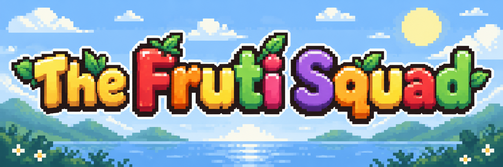

<div align="center">



# 🍓 Fruti Squad

**Un squad de agentes para estructurar, gobernar, construir, auditar y documentar interfaces sin reconstruir todo el contexto en cada petición.**

🥝 **Kiwi** → 🟢 **Lima** → 🥥 **Coco** → 🫐 **Mora**

</div>

---

## Qué es

Fruti Squad es un conjunto portable de agentes y skills para trabajar sobre sistemas de diseño e interfaces desde lenguaje natural.

La idea es sencilla: tú describes el trabajo, no el protocolo interno.

```text
"Rediseña este formulario"
"Ahora haz el de registro"
"Audítalo"
"Promuévelo a estable"
```

El Squad resuelve internamente quién debe actuar, qué contexto necesita y qué debe entregar al siguiente agente.

## Responsabilidades

| Orden | Agente | Responsabilidad |
|---|---|---|
| 1 | 🥝 Kiwi | Estructura: brief, user flow y wireframes F0–F2 |
| 2 | 🟢 Lima | Gobernanza: clasificación, reutilización, contratos, registry y lifecycle |
| 3 | 🥥 Coco | Construcción: F3, implementación y auditoría canónica |
| 4 | 🫐 Mora | Documentación: publica únicamente lo implementado y verificado |
| — | 🍇 Uva (opcional) | Iconos SVG a medida desde una foto o descripción, con movimiento CSS opcional |

Regla principal:

```text
Kiwi estructura → Lima gobierna → Coco construye/verifica → Mora documenta
```

No hay dos auditores ni dos propietarios del lifecycle.

Uva no forma parte de la cadena: es un miembro lateral que entrega iconos verificados a Coco.

---

# Instalación

## Requisitos

- Git
- Node.js 16 o superior
- Un entorno compatible: Claude Code, Codex o Kiro

## Instalación guiada

Desde el proyecto donde quieras utilizar Fruti Squad:

```bash
npx github:kevinedgm/fruti-squad setup --target codex
```

También puedes usar:

```bash
npx github:kevinedgm/fruti-squad setup --target claude
npx github:kevinedgm/fruti-squad setup --target kiro
```

`setup` instala el Squad y ejecuta el asistente para crear el perfil del proyecto.

Si ya tienes la configuración preparada y solo quieres instalar:

```bash
npx github:kevinedgm/fruti-squad install --target codex
```

Cambia `codex` por `claude` o `kiro` según corresponda.

### Claude Code

Con `--target claude` el instalador deja:

- `.claude/skills/{kiwi,lima,coco,mora-docs}/` — cada miembro como Skill (mora se instala como `mora-docs` en Claude y Codex para no chocar con otras skills llamadas mora).
- `CLAUDE.md` — bloque del Squad que importa `.fruti/policy.md` (la política de ruteo, la misma que usa Codex vía `AGENTS.md`).
- `.fruti/paths.yaml` — mapa de rutas para resolver las referencias de `.fruti/runtime/*.yaml`.
  Para resolver una ruta desde scripts o desde el agente: `fruti path skills/lima/references/quality-gates.md` imprime la ruta real en el proyecto.

Después basta con pedir en lenguaje natural ("rediseña este formulario") o invocar `kiwi`, `lima`, `coco` o `mora-docs`.

### Uva (opcional)

Uva no se instala por defecto. `--only` reemplaza la lista por defecto, así que nombra a todo el Squad:

```bash
npx github:kevinedgm/fruti-squad install --target claude --only kiwi,lima,coco,mora,uva
```

Luego: "hazme un icono de esta tina de fermentación" (con la foto adjunta) o "anima este icono".

---

# Configuración del proyecto

Fruti Squad usa un perfil de proyecto compartido. Ahí viven las decisiones que no deben inventarse en cada ejecución: design system, tokens, tipografía, breakpoints, rutas, stack, accesibilidad y fuentes de verdad.

Lima gobierna el perfil. Coco puede mantener su contrato de datos y campos específicos de construcción. Los demás agentes consumen esa verdad sin crear configuraciones paralelas.

El perfil es persistente: si cambias un dato del sistema en lenguaje natural, debe actualizarse ahí en lugar de depender de la memoria de la conversación.

---

# Cómo funciona una petición

Ejemplo:

```text
"Rediseña el formulario de registro y ejecuta todo el flujo"
```

El recorrido conceptual es:

```text
PETICIÓN NATURAL
      │
      ▼
🥝 KIWI
brief · flujo · estructura · adaptación
      │
      ▼ handoff compacto
🟢 LIMA
reuse/extend/new/local · contrato · registry
      │
      ▼ handoff compacto
🥥 COCO
F3 · implementación · auditoría
      │
      ▼ compliance report
🟢 LIMA
gates · lifecycle · registry
      │
      ▼
🫐 MORA
documentación del delta verificado
```

Si después dices:

```text
"Ahora haz el formulario de recuperación"
```

el sistema parte del estado persistido y de las fuentes canónicas. No debería reconstruir indiscriminadamente toda la documentación anterior.

---


# Rediseño de una aplicación existente

Fruti Squad puede entrar a un producto ya construido sin asumir que debe reescribirlo ni que su UI actual es correcta.

Cuando detecta intención de rediseño, el flujo es:

```text
UNDERSTANDING
  ↓
REFERENCES (opcional)
  ↓
DESIGN INVENTORY
  ↓
USER SCOPE APPROVAL
  ↓
DESIGN DIRECTION
  ↓
REDESIGN PLAN
  ↓
Kiwi → Lima → Coco → Mora
```

## Understanding

Puedes describir la intención en lenguaje natural:

```text
"Quiero que se vea moderno, pulcro, profesional, claro y nada genérico.
El 90% del uso será móvil."
```

Kiwi comprime esa intención en fuentes aprobadas dentro de `.fruti/design/`, de modo que los agentes posteriores no tengan que reconstruir la conversación.

Las referencias también pueden expresarse naturalmente, por ejemplo: "me gusta la claridad de Notion y la precisión de Linear". Fruti extrae cualidades; no copia componentes, layouts ni estilos de esos productos.

## Design Inventory + checklist

Antes de rediseñar, Kiwi realiza una inspección rápida y agrupa todo lo que puede implicar diseño: foundations, navegación, controles, componentes/patrones, vistas, estados y visualización de datos.

El resultado se presenta como alcance revisable. Cada superficie puede quedar como:

```text
not-reviewed · proposed · approved · excluded · preserve · completed
```

Lo marcado como `excluded` se ignora. Lo marcado como `preserve` conserva su estructura/comportamiento salvo cambio explícito posterior. Solo `approved` entra al plan de rediseño.

## Design Direction

La síntesis aprobada vive en:

```text
.fruti/design/design-direction.yaml
```

Describe cómo debe sentirse el producto (por ejemplo moderno, refinado, claro, mobile-first, no genérico) y qué evitar. Es dirección, no tokens. Los valores visuales concretos siguen perteneciendo a `.fruti/tokens.json`.

## Plan de rediseño

Fruti ordena el trabajo por dependencias, no por capricho de archivos:

```text
Foundations → Primitives → Patterns → Domain components → Views → Polish
```

La aplicación existente sirve para entender funcionalidad y restricciones. No se usa como autoridad de la nueva identidad visual, salvo decisiones que el usuario marque explícitamente como preservadas.


# Probar el Squad de punta a punta

El comando `test` prepara una prueba reproducible del flujo completo sin obligarte a escribir flags internos de Kiwi/Lima/Coco/Mora.

```bash
fruti test --prompt "Diseña un card que muestre tina, día, horas desde la última medición, temperatura y Brix"
```

También puedes entregar una implementación existente como evidencia del estado actual:

```bash
fruti test --file ./src/components/LegacyCard.vue --prompt "Rediseña este componente"
```

Con `npx`:

```bash
npx github:kevinedgm/fruti-squad test \
  --prompt "Diseña un card de tina con prioridad de medición"
```

El comando crea `.fruti/tests/<round>/request.md`. Después pide al agente del entorno:

```text
Ejecuta .fruti/tests/<round>/request.md completo de Kiwi a Mora y
muéstrame result.md y la página final del Design Hub.
```

La prueba exige:

```text
KIWI
  F2 neutral en grises
  geometry contract
  compact / medium / expanded
  estados + decision records
        ↓
LIMA
  reuse / extend / new / local
  validación contra contratos y estándares realmente configurados
        ↓
COCO
  F3 + implementación real
  auditoría + compliance report
        ↓
LIMA
  gate usando la evidencia de Coco
        ↓
MORA
  página canónica del Design Hub
  Preview = componente verificado real
        ↓
result.md
  PASS / PARTIAL / FAIL por etapa
```

Si una guía normativa configurada no está disponible, la prueba debe marcarla como evidencia faltante. No se permite inventarla desde memoria.


# Arquitectura de contexto eficiente

La regla central está en `AGENTS.md` (en un proyecto instalado: `.fruti/policy.md`):

```text
route first → read second
```

Primero se identifica la intención, artefacto, fase y agente propietario. Después se carga únicamente el contexto necesario.

Fruti Squad divide el conocimiento en tres niveles:

```text
L0  Router / runtime contract
    pequeño y barato de interpretar

L1  Contratos ejecutables
    estado, handoffs, manifests y reportes JSON/YAML

L2  Referencias profundas
    documentación Markdown; se consulta bajo demanda
```

Una referencia mencionada en un manual no significa que deba cargarse automáticamente.

La documentación profunda sigue siendo normativa cuando existe ambigüedad, conflicto o una regla que el contrato compacto no puede resolver.

---

# Carpeta `.fruti`

La capa runtime se organiza así:

```text
.fruti/
├── audit-manifest.yaml
├── runtime/
│   ├── kiwi.yaml
│   ├── lima.yaml
│   ├── coco.yaml
│   ├── mora.yaml
│   └── uva.yaml
├── state/
│   └── current.json
├── handoffs/
│   └── current.json
└── reports/
    └── compliance-current.json
```

## `runtime/*.yaml`

Son contratos compactos por agente. Indican qué consume, qué produce y cuándo necesita abrir referencias profundas.

## `state/current.json`

Es memoria operativa compacta: artefacto activo, ronda, propietario, decisiones y punteros relevantes.

No reemplaza las fuentes de verdad. Si contradice el perfil, registry o código real, se repara.

## `handoffs/current.json`

Transporta únicamente lo necesario entre agentes:

- artefacto y ronda;
- agente origen y siguiente propietario;
- decisiones congeladas;
- piezas y clasificación conocida;
- estados requeridos;
- comportamiento adaptativo;
- preguntas abiertas;
- rutas de evidencia;
- delta respecto al handoff anterior.

Nunca debe copiar documentos enteros.

## `audit-manifest.yaml`

Define las reglas de auditoría con identificadores estables.

Los checks deterministas deben ejecutarse mediante scripts/herramientas cuando sea posible. Por ejemplo: DOM inválido, IDs duplicados, overflow horizontal, tokens prohibidos, semántica interactiva, targets táctiles o inconsistencias del registry.

Coco reserva razonamiento para lo que realmente requiere juicio: jerarquía, claridad, densidad, affordance, consistencia, composición adaptativa y regresiones visuales.

## `reports/compliance-current.json`

Es la salida estructurada de Coco. Lima puede usarla para gates y Mora para documentación sin volver a interpretar toda la auditoría.

---

# Qué carga cada agente

## 🥝 Kiwi

Empieza desde estado/perfil y carga únicamente las referencias estructurales necesarias para la fidelidad actual.

Produce brief, flujo/wireframe, evidencia y handoff hacia Lima.

No hace F3, implementación ni auditoría final.

## 🟢 Lima

Consume el handoff de Kiwi, perfil y entrada relevante del registry.

Clasifica cada pieza como `reuse`, `extend`, `new` o `local`, fija contratos y gobierna lifecycle.

Carga referencias de lifecycle, gates, adaptación o promoción únicamente cuando la operación actual las necesita.

## 🥥 Coco

No rehace el brief ni la gobernanza cuando Kiwi/Lima ya entregaron evidencia vigente.

Construye con el sistema real y es el auditor canónico.

Para auditoría empieza por `audit-manifest.yaml` y evidencia automática. Abre estándares extensos únicamente para reglas ambiguas, fallidas o no deterministas.

Produce `compliance-current.json`.

## 🫐 Mora

Parte de registry + compliance report + código/API real + diff afectado.

Documenta el delta implementado y verificado. No reconstruye todo el historial de diseño para escribir una ficha.

## 🍇 Uva

Parte de una foto o descripción y del estilo de iconos del proyecto (tokens `icon.*`, la librería del perfil o su estilo base: 24×24, trazo 1.5, terminaciones redondeadas, `currentColor`).

Trabaja por etapas:

1. **Entender** qué representa y qué debe significar (concepto, uso, rasgos distintivos, confusiones del dominio).
2. **Prototipar** varias variantes que difieren en una decisión de fondo. Redibuja con primitivas; nunca vectoriza la foto.
3. **Evaluar** con un script (`agentes/uva/scripts/check-icon.mjs`), un banco renderizado y una rúbrica basada en Lucide, Material, Carbon, Apple HIG, NN/g y WCAG.
4. **Animar** si el significado es un estado o proceso: ≤5 s, termina en un fotograma con significado y respeta el movimiento reducido.
5. **Proponer**: una página donde comparas las variantes evaluadas y pruebas la recomendada (tamaño, grosor, color, fondo, animación, contraste).
6. **Entregar** la elegida.

Reglas, estándares y patrones: `agentes/uva/references/`. Ejemplo de propuesta: `agentes/uva/examples/propuesta-distilling.html`.

---

# Fuentes de verdad

La carpeta `.fruti` no pretende convertirse en otra religión documental. Cada dato conserva un propietario:

| Información | Fuente canónica |
|---|---|
| Configuración del proyecto | perfil activo de Lima |
| Lifecycle, status, versión y QA | registry |
| API y comportamiento implementado | código/tipos reales |
| Evidencia de auditoría | compliance report + evidencia runtime |
| Estado operativo temporal | `.fruti/state/current.json` |

Cuando el cache contradice una fuente canónica, gana la fuente canónica.

---

# Ejemplos de uso

No necesitas comandos internos ni flags de fase.

```text
"Rediseña esta pantalla"
```

Kiwi comienza por estructura cuando existe incertidumbre estructural y el flujo continúa por el Squad.

```text
"Ahora haz que funcione mejor en móvil"
```

Se reutiliza el artefacto activo y se carga únicamente el contexto de adaptación necesario.

```text
"Audítalo"
```

Coco usa el manifest y evidencia automática primero; después revisa los criterios que requieren juicio.

```text
"Ya está bien, promuévelo a estable"
```

Lima evalúa los gates con la evidencia existente y solicita aprobación cuando el lifecycle la exige.

---

# Principios de diseño del Squad

1. **Lenguaje natural es la interfaz.** El usuario no administra el runtime.
2. **Route first, read second.** No se precargan directorios de referencias.
3. **Persistir decisiones, no conversaciones.** El estado guarda hechos compactos y punteros.
4. **Un propietario por responsabilidad.** Evita auditorías y decisiones duplicadas.
5. **Automatizar lo determinista.** No gastar razonamiento en comprobar lo que un script puede medir.
6. **Documentar el delta.** Mora no reinterpreta todo el proyecto en cada cambio.
7. **Las referencias profundas siguen disponibles.** Optimizar contexto no significa eliminar conocimiento.

---

# Desarrollo

Para trabajar sobre el proyecto:

```bash
git clone https://github.com/kevinedgm/fruti-squad.git
cd fruti-squad
```

Antes de integrar cambios, compara contra `main` y prueba al menos estos escenarios:

```text
1. Nueva pantalla → Kiwi → Lima → Coco → Mora
2. Segunda pantalla del mismo proyecto → verificar reutilización de estado
3. Auditoría → comprobar que Coco usa manifest antes de referencias profundas
4. Cambio pequeño → comprobar que Mora documenta solo el delta
5. Promoción → comprobar que Lima usa compliance + registry
```

La métrica útil no es solo si el resultado final funciona. También importa observar cuántos archivos y referencias se leen para producirlo.

---

## Licencia

MIT. Consulta `LICENSE`.
