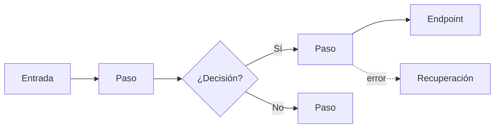

# User flow · OBJETIVO

**Entrada:** · **Endpoint observable:**

```mermaid
flowchart LR
    E["Entrada"] --> P1["Paso"]
    P1 --> D{"¿Decisión?"}
    D -- Sí --> P2["Paso"]
    D -- No --> P3["Paso"]
    P2 --> F["Endpoint"]
    P2 -. error .-> R["Recuperación"]
```

| Paso | Intención | Error posible | Recuperación | ¿Se puede volver? |
|---|---|---|---|---|
