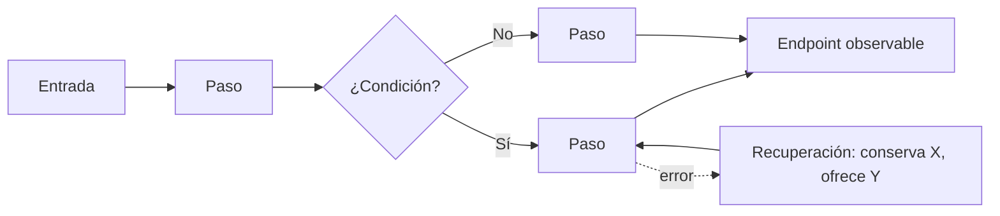

# User flow

Un flujo por **objetivo del usuario**, no por pantalla. Se dibuja antes de las pantallas cuando hay más de una o la feature es nueva.

## Elementos obligatorios

1. **Entrada**: desde dónde llega (enlace, notificación, búsqueda, deep link, sesión reanudada).
2. **Pasos significativos**: solo los que cambian lo que el usuario sabe o decide.
3. **Decisiones** (rombos): condiciones del sistema o elecciones del usuario. Las condicionales se marcan (p. ej. "solo si ≥ 2 colaboradores").
4. **Rutas de error** y **recuperación**: qué falla, qué se conserva, cómo se vuelve.
5. **Endpoint observable**: evidencia concreta de que terminó.

## Formato

## Revisión

- ¿Cada paso tiene una sola intención?
- ¿Hay pasos que solo existen por la implementación y el usuario no necesita ver?
- ¿Se puede volver desde cada paso sin perder datos?
- ¿El flujo sobrevive a sesión reanudada y a cambio de tamaño?
- ¿Los pasos condicionales están marcados y justificados?
